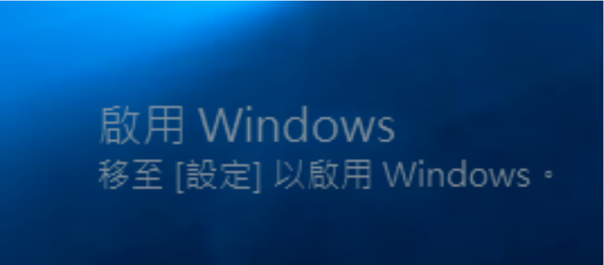

# 啟用 Windows 系統
本篇文章不鼓勵任何盜版行為，僅供測試使用。
## 未啟用
未啟用 windows 10/11 也能符合一般的使用需求，但會於右下角顯示*浮水印並且以下功能無法使用：
<ul>
    <li>個人化設定</li>
    <li>微軟帳戶相關功能</li>
</ul>

### 備註（*）
浮水印：如下圖

### 參考資源
<ol>
    <li>https://asd0961296920.pixnet.net/blog/post/319701542</li>
    <li>https://answers.microsoft.com/zh-hant/windows/forum/all/windows/24773222-2fc2-4f83-86d7-5ecc79eaed3c</li>
</ol>

## <a href="https://support.microsoft.com/zh-tw/windows/%E5%95%9F%E7%94%A8-windows-c39005d4-95ee-b91e-b399-2820fda32227">方法</a>
<ul>
    <li>產品金鑰：25碼字元。</li>
    <li>數位授權：將產品金鑰綁定 Microsoft 帳戶，即可透過登入 Microsoft 帳戶啟用 Windows 系統。</li>
    <li>金鑰管理服務</li>
</ul>

## <a href="https://learn.microsoft.com/zh-tw/windows-server/get-started/kms-activation-planning">金鑰管理服務</a>
金鑰管理服務（Key Management Service，KMS）是由微軟開發的服務，主要用於企業環境中，使組織能夠有效地管理和授權大量的軟體設備，而不需要手動輸入每台設備的產品金鑰。

### <a href="https://learn.microsoft.com/zh-tw/windows-server/get-started/kms-activation-planning#operational-requirements">營運需求</a>
KMS 可以啟用實體和虛擬電腦，但是 KMS 伺服器網路需要符合*啟用條件，才能正常營運 KMS：
<ul>
    <li>Windows 系統：必須擁有至少 25 台電腦</li>
    <li>Microsoft Office 產品：必須擁有至少 5 台電腦</li>
</ul>
根據預設，KMS 伺服器以 TCP 的埠 1688 與用戶端溝通。

#### 備註（*）
啟用條件：KMS 伺服器會記錄用戶端電腦識別碼（CMID）以及用戶端電腦識別碼的數量。

### 限制
KMS 啟用的有效期為 180 天，此期間稱為啟用有效間隔。KMS 用戶端必須至少每 180 天連線到 KMS 主機更新啟用，才能保持啟用狀態。根據預設，KMS 用戶端電腦會每 7 天嘗試更新它們的啟用。用戶端啟用更新之後，啟用有效間隔會重新開始計算。

### <a href="https://learn.microsoft.com/zh-tw/windows-server/get-started/kms-client-activation-keys">啟用</a>
KMS 用戶端可以使用<a href="https://learn.microsoft.com/zh-tw/windows-server/get-started/kms-client-activation-keys">一般大量授權金鑰（Generic Volume License Key，GVLK）</a>啟用系統。

### 風險
KMS 伺服器的管理員操作權限較用戶端高，可以收集用戶端訊息甚至操作用戶端的電腦。

### 基本指令
啟用 Windows 系統會使用到的 *slmgr 基本指令如下：
<ul>
    <li>slmgr -upk：解除當前產品金鑰。</li>
    <li>slmgr -ipk < product key >：安裝產品金鑰。</li>
    <li>slmgr -skms < KMS server's ip >：設置 KMS 伺服器位址及連接埠。</li>
    <li>slmgr -ato：線上啟動 Windows。</li>
    <li>slmgr -xpr：查看當前系統啟動狀態及認證截止日期。</li>
    <li>slmgr -dli：查看 Windows 產品金鑰及認證信息。</li>
    <li>slmgr -dlv：查看詳細的啟動訊息，如系統版本、啟動 ID、安裝 ID及認證狀態等。</li>
</ul>

#### 備註（*）
slmgr：Windows 軟體授權相關指令。

## 實作
為了避免上述風險，可以在本地端建立一個 KMS 伺服器，主要可以使用以下兩種方式實作：
<ul>
    <li>Virtual Machine</li>
    <li>Container</li>
</ul>

### Virtual Machine
此文章以 container 的方式實作。
#### 參考資源
<ol>
    <li>https://www.youtube.com/watch?v=kN6bbg6pMdc</li>
    <li>https://www.youtube.com/watch?v=PUSPbdxNhDg</li>
</ol>

### Container
透過 Docker 的 container 技術，在本地端運行 KMS 伺服器。

#### 步驟
<ol>
    <li>下載 KMS 伺服器的 Image：docker pull mikolatero/vlmcsd</li>
    <li><a href="https://hub.docker.com/r/mikolatero/vlmcsd/">運行 KMS 伺服器</a>：docker run -d -p 1688:1688 --restart=always --name vlmcsd mikolatero/vlmcsd</li>
    <li>解除當前產品金鑰：slmgr -upk</li>
    <li>安裝產品金鑰：slmgr -ipk *W269N-WFGWX-YVC9B-4J6C9-T83GX</li>
    <li>設置 KMS 伺服器位址：slmgr -skms 127.0.0.1</li>
    <li>線上啟動：slmgr -ato</li>
</ol>

#### 備註（*）
產品金鑰：以 win 10 professional 為例，產品金鑰可參考<a href="https://learn.microsoft.com/en-us/windows-server/get-started/kms-client-activation-keys">官網</a>。

### 參考資源
<ol>
    <li>https://learn.microsoft.com/zh-tw/windows-server/get-started/kms-activation-planning</li>
    <li>https://www.youtube.com/watch?v=sz26bnZD7cQ</li>
    <li>https://learn.microsoft.com/zh-tw/windows-server/get-started/kms-client-activation-keys</li>
    <li>https://news.mydrivers.com/1/512/512785.htm</li>
    <li>https://forum.gamer.com.tw/C.php?bsn=60030&snA=592996</li>
    <li>https://learn.microsoft.com/zh-tw/windows-server/get-started/activation-slmgr-vbs-options</li>
    <li>https://stanley676.pixnet.net/blog/post/232241806</li>
    <li>https://www.rixin.info/a/5532.html</li>
    <li>https://blog.futrime.com/zh-cn/p/%E8%87%AA%E5%BB%BAkms%E6%9C%8D%E5%8A%A1%E5%99%A8%E6%BF%80%E6%B4%BBwindows/</li>
    <li>https://hub.docker.com/r/mikolatero/vlmcsd/</li>
</ol>

# <a href="https://github.com/Yintc123/Others/tree/main#others">Home</a>